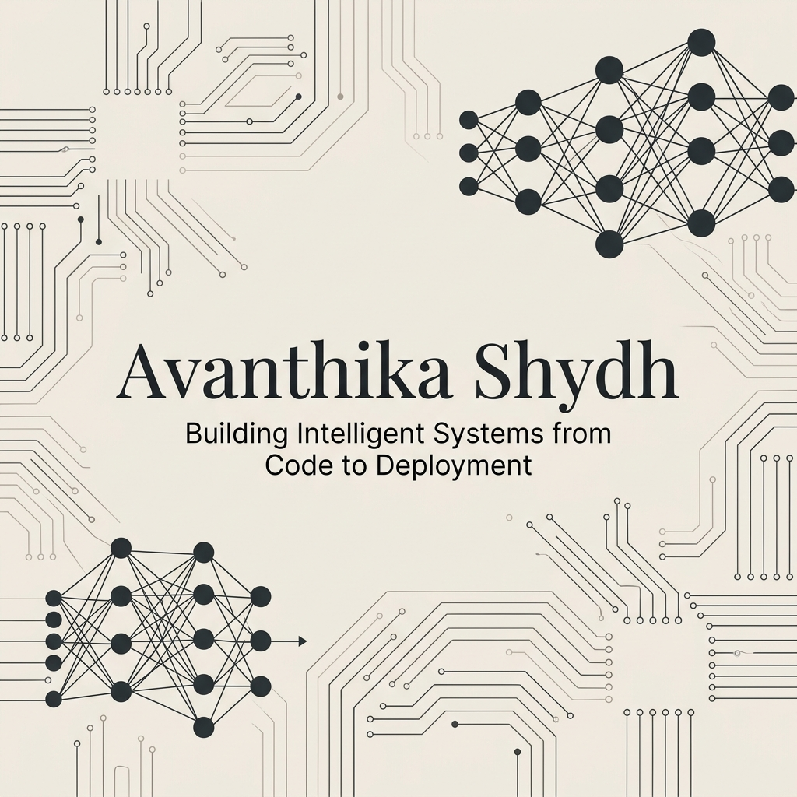

  

  

  
  
  

---

### 🚀 About Me
I am a **quantitatively-driven dual-degree student** at **IIT Madras**, pursuing a **B.Tech in Electrical & Computer Engineering** and a **BS in Data Science**. 

My work sits at the intersection of **hardware and intelligence**. I specialize in developing AI-driven perception models, designing robust embedded systems, and deploying optimized algorithms on edge hardware to solve real-world problems.

- 🎓 **Education**: ELC + Data Science at the Indian Institute of Technology, Madras (IITM).
- 💼 **Industry**: AI Intern at **Tech Mahindra** (optimized FastAPI backends, 3D workflow simulations, and regex search engines).
- 📄 **Research**: Published and presented an AI/LiDAR-driven traffic monitoring research paper at **ICISCoIS 2026** at PSG College of Technology.
- ⚡ **Core Focus**: Edge AI, Computer Vision, Embedded & IoT Architectures, and Predictive Data Science.

---

### 🛠️ Technical Tech Stack

<table>
  <tr>
    <td valign="top" width="50%">
      <h4>💻 Programming Languages</h4>
      
      
      
      
      
    </td>
    <td valign="top" width="50%">
      <h4>🧠 Machine Learning & CV</h4>
      
      
      
      
      
      
    </td>
  </tr>
  <tr>
    <td valign="top" width="50%">
      <h4>🔌 Embedded Systems & IoT</h4>
      
      
      
      
      
    </td>
    <td valign="top" width="50%">
      <h4>☁️ Cloud, Databases & BI</h4>
      
      
      
      
      
    </td>
  </tr>
</table>

---

### 📂 Featured Projects

*   🚗 **AI-Driven Traffic Monitoring System** *(Presented & Published @ ICISCoIS 2026)*
    *   Designed an end-to-end traffic management system integrating **YOLOv8** object detection and **LiDAR** sensor fusion in the **CARLA** simulation environment.
    *   Engineered deep learning models to predict live congestion levels and dynamically adjust signal durations.
    *   *Technologies: Python, YOLOv8, PyTorch, OpenCV, CARLA Simulator, Twilio API*

*   🤖 **Smart Lab Management & Robotic-Arm Simulation**
    *   Engineered a scalable FastAPI backend orchestration platform for autonomous chemical storage, retrieval, and robotic task execution.
    *   Implemented full workflow scheduling, task state machine logic, and 3D rack interactive visualization.
    *   *Technologies: FastAPI, Python, SQLite, SQLAlchemy, REST APIs, Three.js (3D visualization)*

*   🚪 **Contactless Gesture Access & Facial Recognition Booking**
    *   Developed a dual-stage security system featuring an ultrasonic gesture-controlled lock (powered by a **PIC16F877A**) and a Raspberry Pi facial recognition venue reservation gateway utilizing **OpenCV**.
    *   Designed dynamic power relay actuation system to minimize standby energy waste in booked venues.
    *   *Technologies: Embedded C, PIC Microcontroller, Raspberry Pi, OpenCV, IoT Relays*

*   🔍 **District Crime Type Prediction**
    *   Developed a robust Random Forest classifier in Python utilizing target encoding and Hyperparameter Optimization (GridSearchCV) to predict regional crime patterns across Indian districts.
    *   Achieved **95% prediction accuracy** on testing sets.
    *   *Technologies: Python, Scikit-learn, Random Forest, Pandas*

---

### 📜 Certifications & Credentials
- ☁️ **Developing Serverless Solutions on AWS** (Feb 2026) — Event-driven backend development (AWS Lambda, API Gateway, DynamoDB, Step Functions).
- 📊 **IBM Data Analyst Professional Certificate** (2024) — Python, SQL, Excel, and Cognos.

---

### 📊 GitHub Analytics

  
  

  

